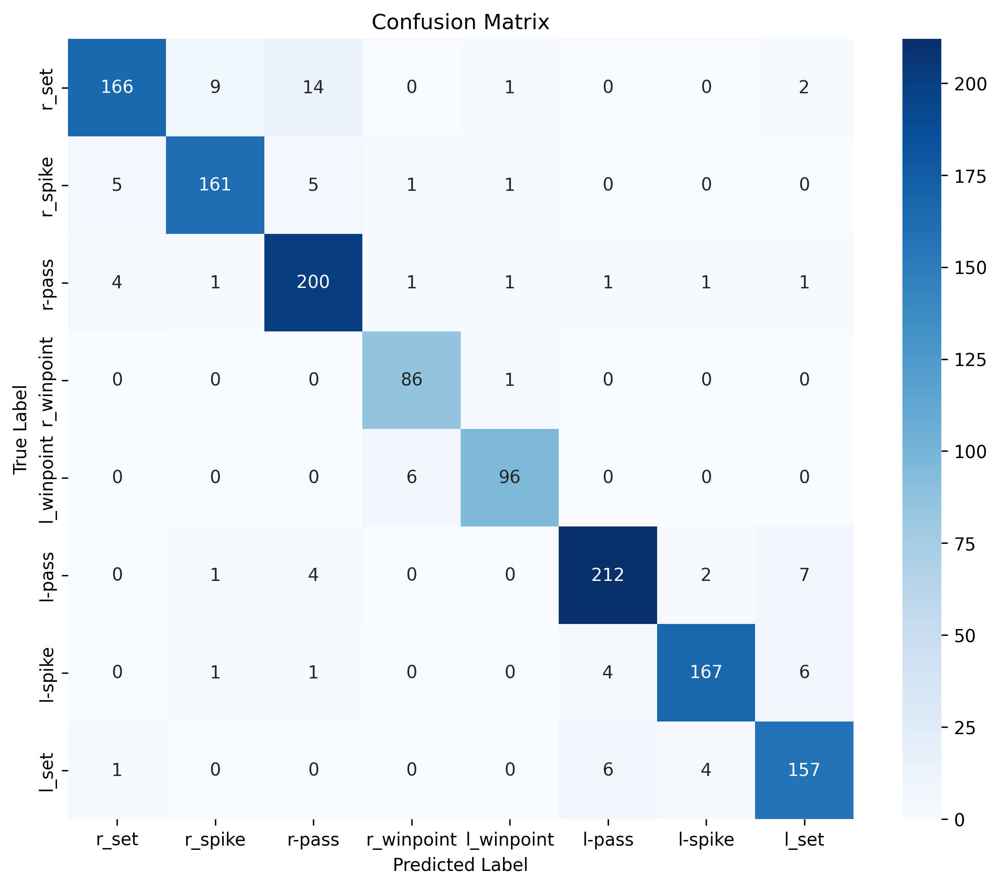

# 🏐 Group Activity Recognition
### PyTorch Implementation of *A modern, from-scratch implementation of a hierarchical deep temporal model for group activity recognition, featuring an optimized two-stage LSTM pipeline that captures individual and collective dynamics in video. Designed with clean architecture and reproducibility in mind, showcasing strong applied deep learning and sequence modeling skills*

<p align="center">
  <a href="https://arxiv.org/pdf/1607.02643">
    
  </a>
  
  
  
</p>

---

## 📌 Overview

This repository is a PyTorch implementation of the paper:

> **Hierarchical Deep Temporal Models for Group Activity Recognition**  
> Mostafa S. Ibrahim, Srikanth Muralidharan, Zhiwei Deng, Arash Vahdat, Greg Mori  
> *IEEE Transactions on Pattern Analysis and Machine Intelligence (TPAMI), 2016*  
> 📄 [Read the Paper](https://arxiv.org/pdf/1607.02643)

The paper addresses the problem of classifying group activities in video by modeling both **individual person dynamics** and **scene-level group dynamics** through a two-stage hierarchical LSTM architecture. A person-level LSTM captures each player's temporal action context, while a scene-level LSTM aggregates those representations to infer the overall group activity.

---

## 🏗️ Model Architecture

The model follows a two-stage hierarchical design:

```
Input Frames  ──►  CNN (AlexNet/VGG)  ──►  Person-Level LSTM  ──►  Pooling  ──►  Group-Level LSTM  ──►  Classification
                   (per-player crops)       (action dynamics)                    (scene dynamics)
```

| Stage | Description |
|---|---|
| **Stage 1 — Person LSTM** | Models temporal action dynamics for each tracked individual using a 9-timestep LSTM with 3000 hidden units |
| **Pooling** | Aggregates person-level features across all players in the scene (max / sum / average pooling) |
| **Stage 2 — Group LSTM** | Learns scene-level temporal patterns over the pooled representations for final group activity classification |

---

## 📂 Repository Structure

```
GroupActivityRecognition/
├── data/                    # Dataset loading and preprocessing
├── models/                  # Model definitions (CNN + LSTM stages)
├── utils/                   # Helper functions and metrics
├── train.py                 # Training script
├── test.py                  # Evaluation script
├── config.py                # Hyperparameters and experiment settings
└── requirements.txt         # Dependencies
```

---

## 🗂️ Dataset

This implementation is evaluated on the **Volleyball Dataset** introduced in the paper.

| Property | Details |
|---|---|
| Videos | 55 volleyball match clips from YouTube |
| Clips | 4,830 trimmed group activity instances |
| Group Activity Classes | 8 (right/left spike, set, pass, winpoint) |
| Individual Action Classes | 9 (spiking, blocking, setting, jumping, digging, standing, falling, waiting, moving) |
| Frames per Clip | 41 frames (center frame is labeled) |

Download the dataset from the [official repository](https://github.com/mostafa-saad/deep-activity-rec).

---

## ⚙️ Installation

```bash
git clone https://github.com/AbdelrahmanSaadIdress/GroupActivityRecognition.git
cd GroupActivityRecognition
pip install -r requirements.txt
```

**Requirements:**
- Python 3.9+
- PyTorch ≥ 1.10
- torchvision
- NumPy
- OpenCV

---

## 🚀 Training

```bash
python train.py --config config.py
```

You can modify `config.py` to adjust learning rate, batch size, number of timesteps, pooling strategy, and backbone CNN.

---

## 📊 Results on the Volleyball Dataset

The paper defines a set of progressively stronger baselines (B1–B9), where **B9 represents the full two-stage hierarchical model with the best-performing pooling strategy**.

### Baseline Descriptions

| Baseline | Description |
|---|---|
| **B1** | Image Classification — whole-frame CNN, no person modeling |
| **B3** | Fine-tuned Person Classification — B2 with fine-tuned CNN |
| **B4** | Temporal Model with Image Features — LSTM over whole-frame features |
| **B5** | Temporal Model with Person Features — LSTM over person crops |
| **B6** | Two-stage Model without LSTM 1 — group LSTM only, no person LSTM |
| **B7** | Two-stage Model without LSTM 2 — person LSTM only, no group LSTM |
| **B8** | Two-stage Hierarchical Model (max pooling) |
| **B9** | Two-stage Hierarchical Model (best spatial pooling) ✅ **Best** |

### Performance Table

| Model | Paper Accuracy (%) | Our Accuracy (%) | Our F1 Score (%) |
|---|:---:|:---:|:---:|
| B1 — Image Classification | 66.7 | 69.72 | 68.46 |
| B3 — Fine-tuned Person Classification | 68.1 | 75.3 | 75.24 |
| B4 — Temporal Model with Image Features | 63.1 | 71.37 | 71.28 |
| B5 — Temporal Model with Person Features | 67.6 | 74.6 | 74.54 |
| B6 — Two-stage Model w/o LSTM 1 | 74.7 | 79.66 | 79.5 |
| B7 — Two-stage Model w/o LSTM 2 | 80.2 | 81.4 | 79.86 |
| B8 — Two-stage Hierarchical (max pooling) | 81.9 | 90.26 | 90.17 |
| **B9 — Two-stage Hierarchical (best pooling)** | **—** | **92.35** | **92.17** |

---

## 🧩 Confusion Matrix (B9)

The confusion matrix below shows the per-class performance of the best-performing model (B9) on the Volleyball Dataset test set.


---

## 📬 Contact

**Abdelrahman Saad Idrees**  
Feel free to open an issue or reach out for questions, bug reports, or collaboration ideas.
---